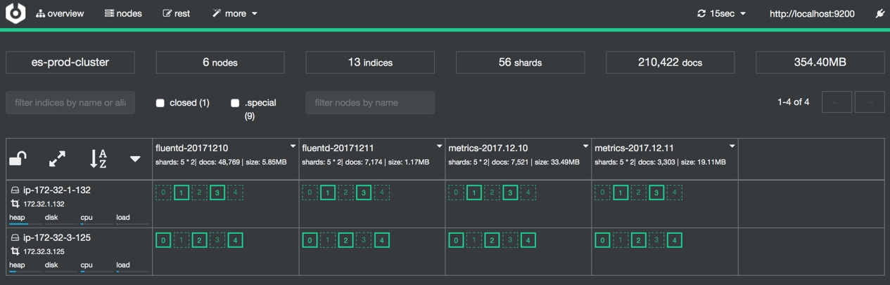
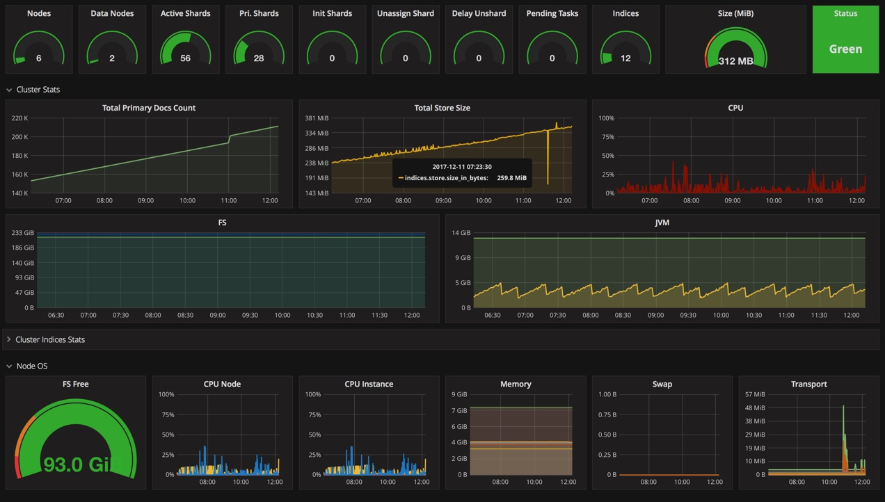

# Deploy Elasticsearch Cluster on AWS

This repository contains a set of tools and scripts to deploy an Elasticsearch cluster on the cloud, using best-practices and state of the art tooling.

Features:

* Deployment of data and master nodes as separate nodes
* Client node with Kibana, cerebro and authenticated Elasticsearch access
* DNS and load-balancing access to client nodes
* Sealed from external access, only accessible via password-protected external facing client nodes


# High Level Architecture


# Technology stack
* ElasticSearch
* X-pack (ElasticSearch and kibana Plugin)
* EC2-discovery (ElasticSearch Plugin)
* repository-S3 (ElasticSearch Plugin)
* Kibana
* Grafana
* Cerebro
* Nginx

# ES Stack Component

* Master Node
* Data Node
* Client Node (coordinator)

### Master Node:

The master node is responsible for lightweight cluster-wide actions such as creating or deleting an index, tracking which nodes are part of the cluster, and deciding which shards to allocate to which nodes. It is important for cluster health to have a stable master node. Indexing and searching your data is CPU-, memory-, and I/O-intensive work which can put pressure on a node’s resources.


### Data Node:

Data nodes hold the shards that contain the documents you have indexed. Data nodes handle data related operations like CRUD, search, and aggregations. These operations are I/O-, memory-, and CPU-intensive. It is important to monitor these resources and to add more data nodes if they are overloaded.
The main benefit of having dedicated data nodes is the separation of the master and data roles.

### Client Node

Requests like search requests or bulk-indexing requests may involve data held on different data nodes. A search request, for example, is executed in two phases which are coordinated by the node which receives the client request — the coordinating node. In the scatter phase, the coordinating node forwards the request to the data nodes which hold the data. Each data node executes the request locally and returns its results to the coordinating node. In the gather phase, the coordinating node reduces each data node’s results into a single global resultset. Every node is implicitly a coordinating node. This means that a node that has all three node.master, node.data and node.ingest set to false will only act as a coordinating node, which cannot be disabled. As a result, such a node needs to have enough memory and CPU in order to deal with the gather phase.


### What is Shard and Replica?


**shard** – Elasticsearch is a distributed search engine, an index is usually split into elements known as shards that are distributed across multiple nodes. Elasticsearch automatically manages the arrangement of these shards. It also rebalances the shards as necessary, so users need not worry about the details.

**replica** – By default, Elasticsearch creates five primary shards and one replica for each index. This means that each index will consist of five primary shards, and each shard will have one copy.

Allocating multiple shards and replicas is the essence of the design for distributed search capability, providing for high availability and quick access in searches against the documents within an index. The main difference between a primary and a replica shard is that only the primary shard can accept indexing requests. Both replica and primary shards can serve querying requests.

In the diagram above, we have an Elasticsearch cluster consisting of two nodes in a default shard configuration. Elasticsearch automatically arranges the five primary shards split across the two nodes. There is one replica shard that corresponds to each primary shard, but the arrangement of these replica shards is altogether different from that of the primary shards. Again, think distribution.


If you want to learn more about replica and shard. visit [this link.](https://enonic.com/docs/4.7/cluster-configuration.html)


## How to use this repo:

Clone this repo to work locally. You might want to fork it in case you need to apply some additional configurations or commit changes to the variables file.


### Elasticsearch and Kibana machine images

This Packer configuration will generate Ubuntu images with Elasticsearch, Kibana and other important tools for deploying and managing Elasticsearch clusters on the cloud.

The output of running Packer here would be two machine images, as below:

* elasticsearch node image, containing latest Elasticsearch installed (latest version 5.5.6) and configured with best-practices.
* kibana node image, based on the elasticsearch node image, and with Kibana (5.5.6, latest), nginx with basic proxy and authentication and cerebro.

Using the AWS builder will create the two images and store them as AMIs.

As a convention the Packer builders will use a dedicated IAM roles, which you will need to have present.

### Install Prerequisite (MacOX):
```shell
$ brew install awscli
$ brew install terraform
$ brew install packer
```

Configure your `awscli` using `aws configure`. It will prompt you to put `AWS_ACCESS_KEY` and `AWS_SECRET_KEY` 

```shell
aws iam create-role --role-name packer --assume-role-policy-document '{
  "Version": "2012-10-17",
  "Statement": {
    "Effect": "Allow",
    "Principal": {"Service": "ec2.amazonaws.com"},
    "Action": "sts:AssumeRole",
    "Sid": ""
  }
}'
```

Response will look something like this:

```json
{
    "Role": {
        "AssumeRolePolicyDocument": {
            "Version": "2012-10-17",
            "Statement": {
                "Action": "sts:AssumeRole",
                "Effect": "Allow",
                "Principal": {
                    "Service": "ec2.amazonaws.com"
                }
            }
        },
        "RoleId": "AROAJ7Q2L7NZJHZBB6JKY",
        "CreateDate": "2016-12-16T13:22:47.254Z",
        "RoleName": "packer",
        "Path": "/",
        "Arn": "arn:aws:iam::611111111117:role/packer"
    }
}
```

Follow up by execting the following

```bash
aws iam create-instance-profile --instance-profile-name packer
aws iam add-role-to-instance-profile  --instance-profile-name packer --role-name packer
```

## Create key-pair

```bash
aws ec2 create-key-pair --key-name elasticsearch --query 'KeyMaterial' --output text > elasticsearch.pem
```

# Run ssh agent and add your key

```shell
eval "$(ssh-agent -s)"
ssh-add elasticsearch.pem
```

## Image Building

Building the AMIs is done using the following commands:

```bash
cd elasticsearch/packer
packer build -only=amazon-ebs -var-file=variables.json elasticsearch-node.packer.json
```

After successfully build AMI your will get an AMI ID. copy this AMI ID and make change `variables.json` file accordingly. After that run below commnad.

```bash
packer build -only=amazon-ebs -var-file=variables.json kibana-node.packer.json
```

## Terraform

Navigate to 
```shell 
cd ../terraform
```
Before apply terraform you need to change `variable.tf` as you require. If you want to run a multi node cluster, you need to open up `variable.tf` and make `cluster_mode` variable to `true` and also `masters_count=3` , `datas_count=2` and `clients_count=1`

Following variable needs to change:

* es_cluster `string`
* vpc_id `string`
* availability_zones `list`
* vpc_subnets_private `list`
* key_name `string`
* environment `string`
* data_instance_type `string`
* cluster_mode `string`
* master_instance_type `string`
* elasticsearch_volume_size `string` / `init`
* volume_name `string`
* volume_encryption `bool`
* elasticsearch_data_dir `string`
* elasticsearch_logs_dir `string`
* data_heap_size `string` / `init`
* master_heap_size `string` / `init`
* masters_count `init`
* datas_count `init`
* clients_count `init`
* security_enabled `bool`
* client_user `string`
* client_pwd `string`


**AWS Crediential Setting for terraform:**
```shell
$ export AWS_ACCESS_KEY_ID="anaccesskey"
$ export AWS_SECRET_ACCESS_KEY="asecretkey"
$ export AWS_DEFAULT_REGION="ap-southeast-1"
```

**Provision Cluster:**
```shell
$ terraform init
$ terraform plan -var aws_region=ap-southeast-1
$ terraform apply -var aws_region=ap-southeast-1
```
When `terraform apply` prompt you to confirm then type `yes`. It will take 3 to 4 min to bring up the full blown elasticsearch cluster with so cool monitoring tools.

Terraform output will give you a ELB DNS endpoint.

```shell
Outputs:
clients_dns = [
    internal-es-prod-cluster-client-lb-1199521904.ap-southeast-1.elb.amazonaws.com
]
```

Once you run `terraform apply` on any of the terraform folders in this repo, a file `terraform.tfstate` will be created. This file contains the mapping between your cloud elements to the terraform configuration. Make sure to keep this file safe.
  
See [this guide](https://blog.gruntwork.io/how-to-manage-terraform-state-28f5697e68fa#.fbb2nalw6) for a discussion on tfstate management and locking between team members.

# Monitoning

**cerebro:** 
Hit your ELB endpoint `http://internal-es-prod-cluster-client-lb-1199521904.ap-southeast-1.elb.amazonaws.com/cerebro`

### configure cerebro


enter `http://localhost:9200` as a elasticsearch endpoint.



**Grafana:** 
Hit your ELB endpoint `http://internal-es-prod-cluster-client-lb-1199521904.ap-southeast-1.elb.amazonaws.com:3000` 


### configure Grafana:
1. Create Data source: 


2. Import dashboard
Dashboard --> Import --> upload .json File --> select `es-dashboard.json` from monitoring directory --> import




### Kibana Dashboard:


# Troubleshooting:

# TODO:

# FAQ: 

# Elasticsearch cheatsheet
* https://gist.github.com/ruanbekker/e8a09604b14f37e8d2f743a87b930f93
* http://elasticsearch-cheatsheet.jolicode.com/
